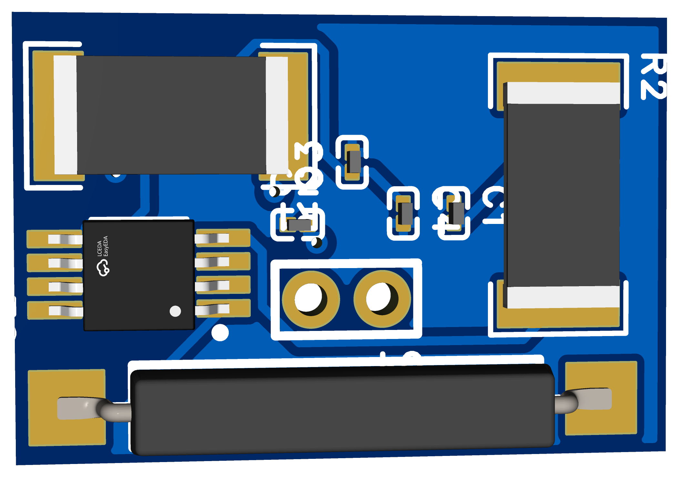

#  Class D Audio Amplifier PCB Design

 Project Overview
This project demonstrates the design and PCB implementation of a **Class-D Audio Amplifier** using the **MD4103S** integrated circuit.  
The amplifier converts an analog audio input signal into a high-efficiency pulse-width-modulated (PWM) output suitable for driving speakers directly.

---

Features
- **High efficiency** due to Class-D topology  
- **Compact 2-layer PCB design** in EasyEDA  
- **Surface-mount component (SMD)** layout for miniaturization  
- **Supports 5V input** and direct speaker output  
- **Thermal and short-circuit protection** integrated into IC  

---

 Components Used
| Component | Value | Description |
|------------|--------|-------------|
| U2 | MD4103S | Class-D amplifier IC |
| C1 | 68 pF | Feedback compensation capacitor |
| C2 | 16 Ω | Load simulation resistor |
| R1, R2 | 16 mΩ | Current sensing resistors |
| C3 | 1 µF | Input coupling capacitor |
| C4 | 10 µF | Output filter capacitor |
| U3 | Switch | Power ON/OFF control |
| U4 | CON_SMD_2P_1.25MM | Audio output connector |

---
 Working Principle
1. The **input audio signal** is fed through the IN+ and IN− pins.  
2. The **MD4103S IC** converts this analog signal into a PWM signal, switching transistors at a high frequency.  
3. The **low-pass filter (capacitors and resistors)** smooths the PWM signal back into an amplified analog waveform.  
4. The **output** drives the speaker through VO+ and VO− pins.  

---

 PCB Details
- **Software Used:** EasyEDA  
- **Layers:** 2  
- **Board Size:** Compact form factor  
- **Copper Thickness:** 1 oz  
- **SMD Components:** 0603 size resistors and capacitors  

---

 PCB Previews
- **Schematic Diagram:** [`class d amp schematic.pdf`](class%20d%20amp%20schematic.pdf)  
- **PCB Traces Layout:** [`class d amp tracer.pdf`](class%20d%20amp%20tracer.pdf)  
- **3D View:**  
  

---

 Power Supply & Output
- **Power Input:** +5V DC  
- **Speaker Output:** Single channel, up to 3W (depending on load impedance)  
- **Recommended Speaker:** 4Ω or 8Ω small driver  

---

 Tools & Libraries
- EasyEDA for schematic and PCB design  
- LCSC component library for footprint and BOM integration  
- JLCPCB fabrication-ready output  

---

 Future Improvements
- Dual-channel stereo version  
- Onboard volume control potentiometer  
- Integrated Bluetooth audio input  

---

 Author
**Chetana Patil**  
📍 Nashik, Maharashtra, India
